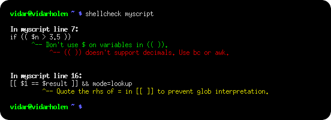
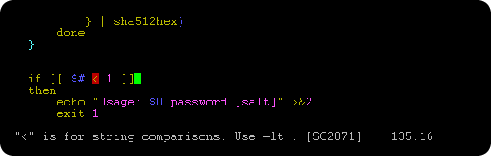
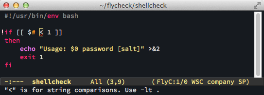

[](https://travis-ci.org/koalaman/shellcheck)

# ShellCheck - A shell script static analysis tool

ShellCheck is a GPLv3 tool that gives warnings and suggestions for bash/sh shell scripts:



The goals of ShellCheck are

* To point out and clarify typical beginner's syntax issues that cause a shell
  to give cryptic error messages.

* To point out and clarify typical intermediate level semantic problems that
  cause a shell to behave strangely and counter-intuitively.

* To point out subtle caveats, corner cases and pitfalls that may cause an
  advanced user's otherwise working script to fail under future circumstances.

See [the gallery of bad code](README.md#user-content-gallery-of-bad-code) for examples of what ShellCheck can help you identify!

## Table of Contents

* [How to use](#how-to-use)
  * [On the web](#on-the-web)
  * [From your terminal](#from-your-terminal)
  * [In your editor](#in-your-editor)
  * [In your build or test suites](#in-your-build-or-test-suites)
* [Installing](#installing)
* [Compiling from source](#compiling-from-source)
  * [Installing Cabal](#installing-cabal)
  * [Compiling ShellCheck](#compiling-shellcheck)
  * [Running tests](#running-tests)
* [Gallery of bad code](#gallery-of-bad-code)
  * [Quoting](#quoting)
  * [Conditionals](#conditionals)
  * [Frequently misused commands](#frequently-misused-commands)
  * [Common beginner's mistakes](#common-beginners-mistakes)
  * [Style](#style)
  * [Data and typing errors](#data-and-typing-errors)
  * [Robustness](#robustness)
  * [Portability](#portability)
  * [Miscellaneous](#miscellaneous)
* [Testimonials](#testimonials)
* [Ignoring issues](#ignoring-issues)
* [Reporting bugs](#reporting-bugs)
* [Contributing](#contributing)
* [Copyright](#copyright)
* [Other Resources](#other-resources)

## How to use

There are a number of ways to use ShellCheck!

### On the web

Paste a shell script on <https://www.shellcheck.net> for instant feedback.

[ShellCheck.net](https://www.shellcheck.net) is always synchronized to the latest git commit, and is the easiest way to give ShellCheck a go. Tell your friends!

### From your terminal

Run `shellcheck yourscript` in your terminal for instant output, as seen above.

### In your editor

You can see ShellCheck suggestions directly in a variety of editors.

* Vim, through [ALE](https://github.com/w0rp/ale), [Neomake](https://github.com/neomake/neomake), or [Syntastic](https://github.com/scrooloose/syntastic):

.

* Emacs, through [Flycheck](https://github.com/flycheck/flycheck) or [Flymake](https://github.com/federicotdn/flymake-shellcheck):

.

* Sublime, through [SublimeLinter](https://github.com/SublimeLinter/SublimeLinter-shellcheck).

* Atom, through [Linter](https://github.com/AtomLinter/linter-shellcheck).

* VSCode, through [vscode-shellcheck](https://github.com/timonwong/vscode-shellcheck).

* Most other editors, through [GCC error compatibility](shellcheck.1.md#user-content-formats).

### In your build or test suites

While ShellCheck is mostly intended for interactive use, it can easily be added to builds or test suites.
It makes canonical use of exit codes, so you can just add a `shellcheck` command as part of the process.

For example, in a Makefile:

```Makefile
check-scripts:
    # Fail if any of these files have warnings
    shellcheck myscripts/*.sh
```

or in a Travis CI `.travis.yml` file:

```yaml
script:
  # Fail if any of these files have warnings
  - shellcheck myscripts/*.sh
```

Services and platforms that have ShellCheck pre-installed and ready to use:

* [Travis CI](https://travis-ci.org/)
* [Codacy](https://www.codacy.com/)
* [Code Climate](https://codeclimate.com/)
* [Code Factor](https://www.codefactor.io/)
* [Github](https://github.com/features/actions)(only Linux)

Services and platforms with third party plugins:

* [SonarQube](https://www.sonarqube.org/) through [sonar-shellcheck-plugin](https://github.com/emerald-squad/sonar-shellcheck-plugin)

Most other services, including [GitLab](https://about.gitlab.com/), let you install
ShellCheck yourself, either through the system's package manager (see [Installing](#installing)),
or by downloading and unpacking a [binary release](#installing-a-pre-compiled-binary).

It's a good idea to manually install a specific ShellCheck version regardless. This avoids
any surprise build breaks when a new version with new warnings is published.

For customized filtering or reporting, ShellCheck can output simple JSON, CheckStyle compatible XML,
GCC compatible warnings as well as human readable text (with or without ANSI colors). See the
[Integration](https://github.com/koalaman/shellcheck/wiki/Integration) wiki page for more documentation.

## Installing

The easiest way to install ShellCheck locally is through your package manager.

On systems with Cabal (installs to `~/.cabal/bin`):

    cabal update
    cabal install ShellCheck

On systems with Stack (installs to `~/.local/bin`):

    stack update
    stack install ShellCheck

On Debian based distros:

    apt-get install shellcheck

On Arch Linux based distros:

    pacman -S shellcheck

or get the dependency free [shellcheck-bin](https://aur.archlinux.org/packages/shellcheck-bin/) from the AUR.

On Gentoo based distros:

    emerge --ask shellcheck

On EPEL based distros:

    yum -y install epel-release
    yum install ShellCheck

On Fedora based distros:

    dnf install ShellCheck

On FreeBSD:

    pkg install hs-ShellCheck

On OS X with homebrew:

    brew install shellcheck

On OpenBSD:

    pkg_add shellcheck

On openSUSE

    zypper in ShellCheck

Or use OneClickInstall - <https://software.opensuse.org/package/ShellCheck>

On Solus:

    eopkg install shellcheck

On Windows (via [chocolatey](https://chocolatey.org/packages/shellcheck)):

```cmd
C:\> choco install shellcheck
```

Or Windows (via [scoop](http://scoop.sh)):

```cmd
C:\> scoop install shellcheck
```

From Snap Store:

    snap install --channel=edge shellcheck

From Docker Hub:

```sh
docker run --rm -v "$PWD:/mnt" koalaman/shellcheck:stable myscript
# Or :v0.4.7 for that version, or :latest for daily builds
```

or use `koalaman/shellcheck-alpine` if you want a larger Alpine Linux based image to extend. It works exactly like a regular Alpine image, but has shellcheck preinstalled.

Using the [nix package manager](https://nixos.org/nix):
```sh
nix-env -iA nixpkgs.shellcheck
```

Alternatively, you can download pre-compiled binaries for the latest release here:

* [Linux, x86_64](https://github.com/koalaman/shellcheck/releases/download/stable/shellcheck-stable.linux.x86_64.tar.xz) (statically linked)
* [Linux, armv6hf](https://github.com/koalaman/shellcheck/releases/download/stable/shellcheck-stable.linux.armv6hf.tar.xz), i.e. Raspberry Pi (statically linked)
* [Linux, aarch64](https://github.com/koalaman/shellcheck/releases/download/stable/shellcheck-stable.linux.aarch64.tar.xz) aka ARM64 (statically linked)
* [MacOS, x86_64](https://github.com/koalaman/shellcheck/releases/download/stable/shellcheck-stable.darwin.x86_64.tar.xz)
* [Windows, x86](https://github.com/koalaman/shellcheck/releases/download/stable/shellcheck-stable.zip)

or see the [GitHub Releases](https://github.com/koalaman/shellcheck/releases) for other releases
(including the [latest](https://github.com/koalaman/shellcheck/releases/tag/latest) meta-release for daily git builds).

Distro packages already come with a `man` page. If you are building from source, it can be installed with:

```console
pandoc -s -f markdown-smart -t man shellcheck.1.md -o shellcheck.1
sudo mv shellcheck.1 /usr/share/man/man1
```

### Travis CI

Travis CI has now integrated ShellCheck by default, so you don't need to manually install it.

If you still want to do so in order to upgrade at your leisure or ensure you're
using the latest release, follow the steps below to install a binary version.

### Installing a pre-compiled binary

The pre-compiled binaries come in `tar.xz` files. To decompress them, make sure
`xz` is installed.
On Debian/Ubuntu/Mint, you can `apt install xz-utils`.
On Redhat/Fedora/CentOS, `yum -y install xz`.

A simple installer may do something like:

```bash
scversion="stable" # or "v0.4.7", or "latest"
wget -qO- "https://github.com/koalaman/shellcheck/releases/download/${scversion?}/shellcheck-${scversion?}.linux.x86_64.tar.xz" | tar -xJv
cp "shellcheck-${scversion}/shellcheck" /usr/bin/
shellcheck --version
```

## Compiling from source

This section describes how to build ShellCheck from a source directory. ShellCheck is written in Haskell and requires 2GB of RAM to compile.

### Installing Cabal

ShellCheck is built and packaged using Cabal. Install the package `cabal-install` from your system's package manager (with e.g. `apt-get`, `brew`, `emerge`, `yum`, or `zypper`).

On MacOS (OS X), you can do a fast install of Cabal using brew, which takes a couple of minutes instead of more than 30 minutes if you try to compile it from source.

    $ brew install cabal-install

On MacPorts, the package is instead called `hs-cabal-install`, while native Windows users should install the latest version of the Haskell platform from <https://www.haskell.org/platform/>

Verify that `cabal` is installed and update its dependency list with

    $ cabal update

### Compiling ShellCheck

`git clone` this repository, and `cd` to the ShellCheck source directory to build/install:

    $ cabal install

Or if you intend to run the tests:

    $ cabal install --enable-tests

This will compile ShellCheck and install it to your `~/.cabal/bin` directory.

Add this directory to your `PATH` (for bash, add this to your `~/.bashrc`):

```sh
export PATH="$HOME/.cabal/bin:$PATH"
```

Log out and in again, and verify that your PATH is set up correctly:

```sh
$ which shellcheck
~/.cabal/bin/shellcheck
```

On native Windows, the `PATH` should already be set up, but the system
may use a legacy codepage. In `cmd.exe`, `powershell.exe` and Powershell ISE,
make sure to use a TrueType font, not a Raster font, and set the active
codepage to UTF-8 (65001) with `chcp`:

```cmd
chcp 65001
```

In Powershell ISE, you may need to additionally update the output encoding:

```powershell
[Console]::OutputEncoding = [System.Text.Encoding]::UTF8
```

### Running tests

To run the unit test suite:

    $ cabal test

## Gallery of bad code

So what kind of things does ShellCheck look for? Here is an incomplete list of detected issues.

### Quoting

ShellCheck can recognize several types of incorrect quoting:

```sh
echo $1                           # Unquoted variables
find . -name *.ogg                # Unquoted find/grep patterns
rm "~/my file.txt"                # Quoted tilde expansion
v='--verbose="true"'; cmd $v      # Literal quotes in variables
for f in "*.ogg"                  # Incorrectly quoted 'for' loops
touch $@                          # Unquoted $@
echo 'Don't forget to restart!'   # Singlequote closed by apostrophe
echo 'Don\'t try this at home'    # Attempting to escape ' in ''
echo 'Path is $PATH'              # Variables in single quotes
trap "echo Took ${SECONDS}s" 0    # Prematurely expanded trap
```

### Conditionals

ShellCheck can recognize many types of incorrect test statements.

```sh
[[ n != 0 ]]                      # Constant test expressions
[[ -e *.mpg ]]                    # Existence checks of globs
[[ $foo==0 ]]                     # Always true due to missing spaces
[[ -n "$foo " ]]                  # Always true due to literals
[[ $foo =~ "fo+" ]]               # Quoted regex in =~
[ foo =~ re ]                     # Unsupported [ ] operators
[ $1 -eq "shellcheck" ]           # Numerical comparison of strings
[ $n && $m ]                      # && in [ .. ]
[ grep -q foo file ]              # Command without $(..)
[[ "$$file" == *.jpg ]]           # Comparisons that can't succeed
(( 1 -lt 2 ))                     # Using test operators in ((..))
```

### Frequently misused commands

ShellCheck can recognize instances where commands are used incorrectly:

```sh
grep '*foo*' file                 # Globs in regex contexts
find . -exec foo {} && bar {} \;  # Prematurely terminated find -exec
sudo echo 'Var=42' > /etc/profile # Redirecting sudo
time --format=%s sleep 10         # Passing time(1) flags to time builtin
while read h; do ssh "$h" uptime  # Commands eating while loop input
alias archive='mv $1 /backup'     # Defining aliases with arguments
tr -cd '[a-zA-Z0-9]'              # [] around ranges in tr
exec foo; echo "Done!"            # Misused 'exec'
find -name \*.bak -o -name \*~ -delete  # Implicit precedence in find
# find . -exec foo > bar \;       # Redirections in find
f() { whoami; }; sudo f           # External use of internal functions
```

### Common beginner's mistakes

ShellCheck recognizes many common beginner's syntax errors:

```sh
var = 42                          # Spaces around = in assignments
$foo=42                           # $ in assignments
for $var in *; do ...             # $ in for loop variables
var$n="Hello"                     # Wrong indirect assignment
echo ${var$n}                     # Wrong indirect reference
var=(1, 2, 3)                     # Comma separated arrays
array=( [index] = value )         # Incorrect index initialization
echo $var[14]                     # Missing {} in array references
echo "Argument 10 is $10"         # Positional parameter misreference
if $(myfunction); then ..; fi     # Wrapping commands in $()
else if othercondition; then ..   # Using 'else if'
f; f() { echo "hello world; }     # Using function before definition
[ false ]                         # 'false' being true
if ( -f file )                    # Using (..) instead of test
```

### Style

ShellCheck can make suggestions to improve style:

```sh
[[ -z $(find /tmp | grep mpg) ]]  # Use grep -q instead
a >> log; b >> log; c >> log      # Use a redirection block instead
echo "The time is `date`"         # Use $() instead
cd dir; process *; cd ..;         # Use subshells instead
echo $[1+2]                       # Use standard $((..)) instead of old $[]
echo $(($RANDOM % 6))             # Don't use $ on variables in $((..))
echo "$(date)"                    # Useless use of echo
cat file | grep foo               # Useless use of cat
```

### Data and typing errors

ShellCheck can recognize issues related to data and typing:

```sh
args="$@"                         # Assigning arrays to strings
files=(foo bar); echo "$files"    # Referencing arrays as strings
declare -A arr=(foo bar)          # Associative arrays without index
printf "%s\n" "Arguments: $@."    # Concatenating strings and arrays
[[ $# > 2 ]]                      # Comparing numbers as strings
var=World; echo "Hello " var      # Unused lowercase variables
echo "Hello $name"                # Unassigned lowercase variables
cmd | read bar; echo $bar         # Assignments in subshells
cat foo | cp bar                  # Piping to commands that don't read
printf '%s: %s\n' foo             # Mismatches in printf argument count
```

### Robustness

ShellCheck can make suggestions for improving the robustness of a script:

```sh
rm -rf "$STEAMROOT/"*            # Catastrophic rm
touch ./-l; ls *                 # Globs that could become options
find . -exec sh -c 'a && b {}' \; # Find -exec shell injection
printf "Hello $name"             # Variables in printf format
for f in $(ls *.txt); do         # Iterating over ls output
export MYVAR=$(cmd)              # Masked exit codes
case $version in 2.*) :;; 2.6.*) # Shadowed case branches
```

### Portability

ShellCheck will warn when using features not supported by the shebang. For example, if you set the shebang to `#!/bin/sh`, ShellCheck will warn about portability issues similar to `checkbashisms`:

```sh
echo {1..$n}                     # Works in ksh, but not bash/dash/sh
echo {1..10}                     # Works in ksh and bash, but not dash/sh
echo -n 42                       # Works in ksh, bash and dash, undefined in sh
trap 'exit 42' sigint            # Unportable signal spec
cmd &> file                      # Unportable redirection operator
read foo < /dev/tcp/host/22      # Unportable intercepted files
foo-bar() { ..; }                # Undefined/unsupported function name
[ $UID = 0 ]                     # Variable undefined in dash/sh
local var=value                  # local is undefined in sh
time sleep 1 | sleep 5           # Undefined uses of 'time'
```

### Miscellaneous

ShellCheck recognizes a menagerie of other issues:

```sh
PS1='\e[0;32m\$\e[0m '            # PS1 colors not in \[..\]
PATH="$PATH:~/bin"                # Literal tilde in $PATH
rm “file”                         # Unicode quotes
echo "Hello world"                # Carriage return / DOS line endings
echo hello \                      # Trailing spaces after \
var=42 echo $var                  # Expansion of inlined environment
#!/bin/bash -x -e                 # Common shebang errors
echo $((n/180*100))               # Unnecessary loss of precision
ls *[:digit:].txt                 # Bad character class globs
sed 's/foo/bar/' file > file      # Redirecting to input
while getopts "a" f; do case $f in "b") # Unhandled getopts flags
```

## Testimonials

> At first you're like "shellcheck is awesome" but then you're like "wtf are we still using bash"

Alexander Tarasikov,
[via Twitter](https://twitter.com/astarasikov/status/568825996532707330)

## Ignoring issues

Issues can be ignored via environmental variable, command line, individually or globally within a file:

<https://github.com/koalaman/shellcheck/wiki/Ignore>

## Reporting bugs

Please use the GitHub issue tracker for any bugs or feature suggestions:

<https://github.com/koalaman/shellcheck/issues>

## Contributing

Please submit patches to code or documentation as GitHub pull requests! Check
out the [DevGuide](https://github.com/koalaman/shellcheck/wiki/DevGuide) on the
ShellCheck Wiki.

Contributions must be licensed under the GNU GPLv3.
The contributor retains the copyright.

## Copyright

ShellCheck is licensed under the GNU General Public License, v3. A copy of this license is included in the file [LICENSE](LICENSE).

Copyright 2012-2019, [Vidar 'koala_man' Holen](https://github.com/koalaman/) and contributors.

Happy ShellChecking!

## Other Resources

* The wiki has [long form descriptions](https://github.com/koalaman/shellcheck/wiki/Checks) for each warning, e.g. [SC2221](https://github.com/koalaman/shellcheck/wiki/SC2221).
* ShellCheck does not attempt to enforce any kind of formatting or indenting style, so also check out [shfmt](https://github.com/mvdan/sh)!

